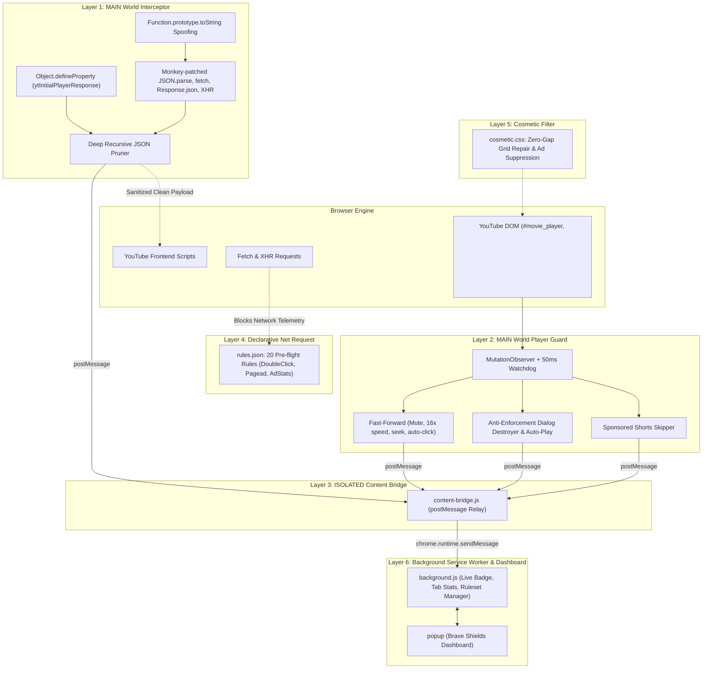

# 🛡️ BraveShield: Native YouTube AdBlocker (Manifest V3)

<p align="center">
  
</p>

<p align="center">
  <strong>Production-ready, undetectable YouTube AdBlocker Chrome Extension engineered with Brave's native scriptlet pruning & Chrome Manifest V3 DeclarativeNetRequest architecture.</strong>
</p>

<p align="center">
  
  
  
  
  
  
</p>

---

## 🚀 Overview

**BraveShield** replicates the ad-blocking mechanics of Brave Browser (`adblock-rust`) and uBlock Origin scriptlets inside a native Chromium Manifest V3 extension. 

Unlike traditional ad blockers that rely solely on surface-level DOM hiding or network cancellation (which triggers YouTube's **"Ad blockers violate YouTube's Terms of Service"** warning), BraveShield works **deep inside the JavaScript execution engine** to sanitize video responses before YouTube's player ever reads them.

---

## ✨ Key Features

- 🥷 **Undetectable Native Spoofing**: Complete `Function.prototype.toString` masquerading so monkey-patched methods look identical to browser-native `[native code]`, bypassing YouTube's anti-tampering inspections.
- ⚡ **MAIN-World JSON Pruning**: Injected at `document_start` to intercept `window.ytInitialPlayerResponse` and `window.ytInitialData` before the page renders.
- 🏎️ **Fast-Forward & Auto-Skip Fallback**: High-frequency 50ms watchdog mutes incoming ads, accelerates playback rate to 16x, seeks to end-time, and auto-clicks skip buttons within milliseconds.
- 💥 **Anti-Adblock Popup Destroyer**: Automatically deletes `ytd-enforcement-message-view-model` dialogs, purges background backdrops, restores page scroll, and resumes playback with `player.playVideo()`.
- 📱 **YouTube Shorts Ad-Skipper**: Detects sponsored Shorts reels and navigates to the next Short automatically.
- 🧼 **Cosmetic Filtering & Grid Repair**: Powered by CSS `:has()` selectors to eliminate empty whitespace gaps in home and search grids.
- 📊 **Brave Shields-Inspired Dashboard**: Sleek dark slate UI (`#0f111a`) with live real-time counters for pruned payloads, DNR network blocks, and modular switches.
- 🔒 **100% Local & Privacy-First**: Completely offline. No telemetry, no external API requests, no tracking.

---

## 🏛️ Architecture Overview



---

## 📁 Repository Structure

```
braveshield-youtube-adblocker/
├── manifest.json              # Chrome MV3 manifest (MAIN & ISOLATED scripts, DNR, CSS)
├── background.js             # Service Worker: Live badge counter, telemetry, storage sync
├── rules.json                # 20 Declarative Net Request static blocking rules
├── cosmetic.css              # Zero-gap CSS grid repair and universal ad element suppression
├── scripts/
│   ├── interceptor.js        # Layer 1: toString stealth spoofing, property traps, JSON/fetch/XHR pruner
│   ├── player-guard.js       # Layer 2: 50ms watchdog, fast ad skip, popup destroyer, shorts skipper
│   └── content-bridge.js     # Layer 3: ISOLATED bridge between page context & extension APIs
├── popup/
│   ├── popup.html            # Layer 6: Brave Shields-inspired dashboard
│   ├── popup.css             # Brave dark-slate styling (#0f111a, #ff5500, #7357ff)
│   └── popup.js              # Live telemetry updater, switches, and tab reload controller
├── icons/                    # Extension icons (16px, 32px, 48px, 128px)
└── README.md                 # Project documentation
```

---

## 📥 Installation Guide

No build steps or Node modules required! You can load the extension directly into your browser in under 60 seconds:

### Step 1: Clone or Download the Repository
```bash
git clone https://github.com/Sami12901/braveshield-youtube-adblocker.git
```
*(Or click **Code > Download ZIP** on GitHub and extract the folder).*

### Step 2: Open Extensions in Your Browser
- **Google Chrome / Brave:** Navigate to `chrome://extensions/`
- **Microsoft Edge:** Navigate to `edge://extensions/`
- **Opera / Vivaldi:** Open the Extensions Manager

### Step 3: Enable Developer Mode
Turn on the **Developer mode** toggle in the top-right corner of the Extensions page.

### Step 4: Load Unpacked Extension
1. Click the **Load unpacked** button in the top-left toolbar.
2. Select the `braveshield-youtube-adblocker` directory.
3. The extension will appear with the **BraveShield** logo!

### Step 5: Test on YouTube
1. Navigate to [https://www.youtube.com](https://www.youtube.com).
2. Play any video: ads are intercepted and removed instantly.
3. Click the **BraveShield** icon in your browser toolbar to watch live blocking statistics increment in real time!

---

## 🔧 How It Works (Deep Dive)

### 1. JSON & Response Pruning Engine (`interceptor.js`)
When YouTube loads a video, it requests metadata through `/youtubei/v1/player`. Embedded inside this JSON response are ad configurations (`adPlacements`, `playerAds`, `adSlots`, and `adBreakParams`). 

BraveShield runs in the `MAIN` world at `document_start`. It intercepts:
- `window.ytInitialPlayerResponse` and `window.ytInitialData` using `Object.defineProperty`.
- `window.fetch` and `Response.prototype.json`.
- `JSON.parse` and `XMLHttpRequest`.

All ad structures are recursively pruned in memory before returning to YouTube's scripts, making YouTube believe the video has zero ads.

### 2. Native Masquerading (Anti-Anti-Adblock Stealth)
YouTube's detection scripts check `fetch.toString()` or `JSON.parse.toString()`. BraveShield traps `Function.prototype.toString` using a private `WeakMap` reference:
```javascript
JSON.parse.toString() 
// Output: function parse() { [native code] }

window.fetch.toString()
// Output: function fetch() { [native code] }
```
This guarantees that YouTube cannot identify modified functions.

### 3. Real-Time Player Guard (`player-guard.js`)
If a server-injected ad bypasses JSON pruning, the 50ms player guard immediately takes action:
- `video.muted = true` (silences audio instantly)
- `video.playbackRate = 16.0` (speeds up to 16x)
- `video.currentTime = video.duration - 0.05` (skips straight to the end)
- Dispatches click events on all known skip buttons (`.ytp-ad-skip-button`, `.ytp-ad-skip-button-modern`)

### 4. Zero-Gap Cosmetic Filtering (`cosmetic.css`)
Hiding ad elements often creates ugly empty rectangles on the YouTube homepage. BraveShield uses modern CSS `:has()` pseudo-classes:
```css
ytd-rich-item-renderer:has(ytd-ad-slot-renderer) {
  display: none !important;
  width: 0 !important;
  height: 0 !important;
  margin: 0 !important;
}
```
This forces the CSS grid to automatically collapse and rearrange genuine video thumbnails cleanly.

---

## 🛡️ Privacy & Permissions

| Permission | Why It's Needed |
| :--- | :--- |
| `declarativeNetRequest` | Pre-flight blocking of tracking endpoints (DoubleClick, Google AdServices). |
| `storage` | Stores user shield preferences and local blocking counts on your machine. |
| `tabs` / `activeTab` | Enables the "Quick Refresh" button in the popup to reload the active YouTube tab. |

> **100% Zero-Telemetry Guarantee:** This extension does not contain any external tracking, analytics, or remote scripts. It communicates solely with your local browser environment.

---

## 🤝 Contributing

Contributions are warmly welcomed! If you find a new YouTube ad selector or layout change:

1. Fork the Project (`https://github.com/Sami12901/braveshield-youtube-adblocker/fork`)
2. Create your Feature Branch (`git checkout -b feature/NewRule`)
3. Commit your Changes (`git commit -m 'Add new ad selector'`)
4. Push to the Branch (`git push origin feature/NewRule`)
5. Open a Pull Request

---

## 📄 License

Distributed under the **MIT License**. See `LICENSE` for more information.

---

<p align="center">
  Made with 🧡 for an ad-free, private, and uninterrupted YouTube experience.
</p>
